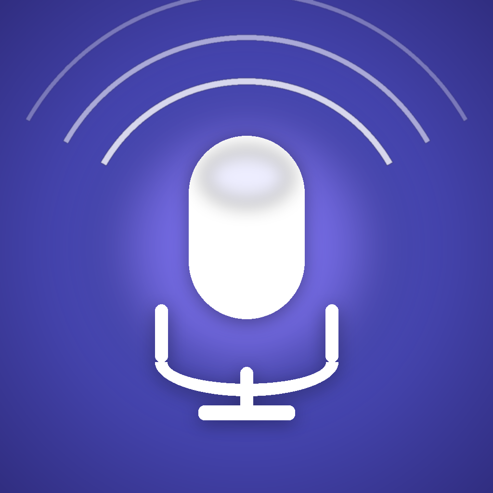

# Whisper Service

> Selbst gehostete Sprache-zu-Text-Pipeline — Server, Web-UI und native iOS-App in einem Repo.

Nimm Sprachmemos auf, lass sie automatisch per [faster-whisper](https://github.com/SYSTRAN/faster-whisper) transkribieren, durchsuche und teile die Ergebnisse. Datenhoheit bleibt zu Hause — auf deinem Server. Geeignet für Notizen, Interviews, Meetings, Podcasts, Vorlesungen, Diktate — alles wofür du Audio zu deutschem Text brauchst.

<p align="center">
  
</p>

---

## Was drin ist

| Teil | Stack | Pfad |
|---|---|---|
| **Server** | Python · Flask · faster-whisper · Docker · GHCR | [`server/`](./server) |
| **Web-UI** | Vanilla JS · MediaRecorder · Web Share API | [`server/templates/`](./server/templates) |
| **iOS-App** | SwiftUI · iOS 18+ · xcodegen | [`ios/`](./ios) |
| **CI** | GitHub Actions baut Image bei jedem `server/`-Push | [`.github/workflows/build.yml`](./.github/workflows/build.yml) |
| **Deploy-Compose** | Stack zieht das fertige Image von ghcr.io | [`docker-compose.yml`](./docker-compose.yml) |

---

## Features

### Web-UI

- 🎙️ **Direkt im Browser aufnehmen** — MediaRecorder + Live-Pegelmeter, keine App nötig (iOS Safari ≥ 14.3, Chrome, Firefox)
- 📤 **Multi-Format-Upload** — m4a, mp3, wav, ogg, flac, webm, mp4 per Drag-and-Drop
- 🗂️ **Jobs nach Datum gruppiert** — Heute / Gestern / Datum
- 🔁 **Retry & Cancel** für fehlgeschlagene Jobs
- 📋 **Modell-Verwaltung** — built-in (`large-v3` / `medium` / `small` / `base`) plus beliebige HuggingFace-CT2-Modelle
- 🔑 **App-Token-Verwaltung** — Tokens für iOS/API erstellen und widerrufen
- 📲 **Teilen per Web Share API** — WhatsApp, Mail, Messages, … direkt aus dem Browser
- 🪟 **Tab-Layout** — Transkribieren · Modelle · App-Tokens

### Server

- ⚡ **GPU oder CPU** — faster-whisper erkennt CUDA automatisch, fällt sonst auf int8-CPU zurück
- 🔐 **Hybrid-Auth** — Browser via [Authelia](https://www.authelia.com/) Forward-Auth, iOS/API via statischem App-Token
- 🍪 **Session-Cookies** signiert (`HTTPOnly`, `Secure`, `SameSite=Strict`)
- 🛡️ **Upload-Cap** — `MAX_UPLOAD_MB` (default 2 GiB) verhindert Disk-Fill-Angriffe
- 💾 **Persistente Volumes** — Modelle und Transkripte überleben Container-Restarts

### iOS-App (WhisperMemo)

- 🎤 **One-Tap-Aufnahme** mit Waveform-Visualisierung
- 🎧 **AirPods / Bluetooth-Headset** als Mikrofon (HFP-Profil, iOS 18+)
- 📶 **Offline-Queue** — Aufnahmen werden lokal gespeichert und automatisch hochgeladen, sobald der Server erreichbar ist
- 🩺 **Server-Reachability via `/health`** — alle 30 s geprobet, ergänzt `NWPathMonitor`
- 📊 **Statistik & Speicher** — lokaler Footprint, Queue-Größe, verwaiste Aufnahmen aufräumen
- 🗣️ **Initial Prompt** für eigenes Fachvokabular (Medizin, Recht, Technik, …)
- 📤 **ShareLink** — Transkripte direkt ins Share-Sheet (Toolbar oder Swipe-Geste)

---

## Architektur

```
                       ┌────────────────────────┐
   Browser ─ Authelia ─┤ whisper-ui  (Traefik) │ ── Cookie-Session
   (forward-auth)      │                       │
                       │ whisper-api (Traefik) │ ── Bearer-Token
   iOS-App ────────────┤  (kein Authelia)      │
   (Bearer)            │                       │
   Public ─────────────┤ whisper-public        │ ── /health, /api/config
                       └──────────┬────────────┘
                                  │
                         ┌────────▼────────┐
                         │  Flask-Service  │
                         │  faster-whisper │
                         │     ffmpeg      │
                         └────┬───────┬────┘
                              │       │
                      /model_cache  /transcripts
                      (Docker Volumes)
```

**Drei Traefik-Router teilen sich denselben Host** (`whisper.example.com`):

| Router | Pfad | Middleware-Chain | Zweck |
|---|---|---|---|
| `whisper-public` | `/health`, `/api/config` | `rate-limit` | Reachability-Probes, App-Setup |
| `whisper-api` | `PathPrefix(/api)` | `rate-limit` | Flask validiert Bearer-Token selbst |
| `whisper-ui` | alles andere | `rate-limit` → `authelia` | Browser-Session via Cookie |

Beim ersten Aufruf von `GET /` setzt Flask anhand des `Remote-User`-Headers eine signierte Session-Cookie. AJAX-Requests an `/api/*` (kein Authelia auf der Route!) authentifizieren sich dann via Cookie. iOS-Clients senden stattdessen `Authorization: Bearer <token>`.

---

## Quickstart

### Voraussetzungen

- Docker-Host mit Traefik + Authelia (z. B. via [Portainer](https://www.portainer.io/) auf TrueNAS)
- Externes Docker-Network `traefik`
- (Optional) NVIDIA-GPU + nvidia-docker für schnelles `large-v3`

### Stack starten

```yaml
# docker-compose.yml — Image kommt direkt von ghcr.io, kein lokaler Build
services:
  whisper:
    image: ghcr.io/mbay-odw/whisper-service:latest
    container_name: whisper-service
    restart: unless-stopped
    environment:
      - WHISPER_MODEL=large-v3
      - TRUST_PROXY_AUTH=true
      - FLASK_SECRET_KEY=<openssl rand -hex 32>
      - MAX_UPLOAD_MB=2048
    volumes:
      - whisper_models:/model_cache
      - whisper_transcripts:/transcripts
    networks:
      - traefik

networks:
  traefik:
    external: true

volumes:
  whisper_models:
  whisper_transcripts:
```

Traefik-Routing wird über einen File-Provider gesetzt (siehe [Traefik-Konfiguration](#traefik-konfiguration) unten).

```bash
docker compose up -d
docker logs -f whisper-service          # warten bis "Model large-v3 loaded successfully."
```

### Web-UI öffnen

1. `https://whisper.example.com` → Authelia-Login
2. Tab **App-Tokens** → Token für die iOS-App erstellen (einmalig sichtbar — sofort kopieren)
3. Im Tab **Transkribieren** entweder Datei droppen oder direkt im Browser aufnehmen

### iOS-App installieren

```bash
cd ios
brew install xcodegen        # nur einmal
xcodegen generate
open WhisperMemo.xcodeproj   # Build & Run aufs Gerät
```

Beim ersten Start: Server-URL eintragen + den eben erstellten App-Token einfügen. Für TestFlight-Verteilung: `Product → Archive` mit Destination "Any iOS Device (arm64)" → Distribute App → App Store Connect.

---

## Konfiguration

### Server-Env-Vars

| Variable | Default | Bedeutung |
|---|---|---|
| `WHISPER_MODEL` | `large-v3` | Default-Modell; pro Job überschreibbar |
| `TRUST_PROXY_AUTH` | `true` | `Remote-User`/`X-Forwarded-User` als Auth akzeptieren |
| `FLASK_SECRET_KEY` | random | Persistente Session-Cookies über Restarts hinweg |
| `MAX_UPLOAD_MB` | `2048` | Hartes Upload-Limit (413 bei Überschreitung) |

### Persistente Dateien

```
/transcripts/
├── .tokens.json        ← Bearer-Tokens (im UI verwaltet, plaintext)
├── .models.json        ← Custom-HuggingFace-Modelle
└── *.txt               ← gespeicherte Transkripte (Dateiname = Timestamp)

/model_cache/
└── …                   ← faster-whisper download_root (gigabyte-große Modelle)
```

### Traefik-Konfiguration

Beispiel-File-Provider (`whisper.yml`):

```yaml
http:
  routers:
    whisper-public:
      rule: "Host(`whisper.example.com`) && (Path(`/health`) || Path(`/api/config`))"
      entrypoints: [websecure]
      service: whisper-svc
      middlewares: [middlewares-rate-limit]
      priority: 30
      tls: {}

    whisper-api:
      rule: "Host(`whisper.example.com`) && PathPrefix(`/api`)"
      entrypoints: [websecure]
      service: whisper-svc
      middlewares: [middlewares-rate-limit]
      priority: 20
      tls: {}

    whisper-ui:
      rule: "Host(`whisper.example.com`)"
      entrypoints: [websecure]
      service: whisper-svc
      middlewares: [middlewares-rate-limit, middlewares-authelia]
      priority: 10
      tls: {}

  services:
    whisper-svc:
      loadBalancer:
        servers:
          - url: "http://whisper-service:5000"
        passHostHeader: true
```

Die `middlewares-rate-limit` und `middlewares-authelia` definierst du global, z. B.:

```yaml
http:
  middlewares:
    middlewares-rate-limit:
      rateLimit:
        average: 100
        burst: 50
    middlewares-authelia:
      forwardAuth:
        address: "http://authelia:9091/api/verify?rd=https://auth.example.com"
        trustForwardHeader: true
        authResponseHeaders: [Remote-User, Remote-Groups, Remote-Email, Remote-Name]
```

---

## Security-Modell

### Auth-Trennung

| Klient | Auth-Methode | Schicht |
|---|---|---|
| **Browser** | Authelia Forward-Auth → `Remote-User` → Flask-Session-Cookie | Traefik (`whisper-ui`) |
| **iOS / Skripte** | `Authorization: Bearer <token>` aus `.tokens.json` | Flask (`whisper-api`) |
| **Public** | keine | Traefik (`whisper-public`) |

### Was App-Tokens dürfen

✅ Upload, Transkription, Job-Listing, Cancel, Retry, Download, Modellliste lesen

❌ Tokens verwalten, Modelle hinzufügen/entfernen, Web-UI rendern (Authelia / `is_browser_auth`-Check blockt)

### Hardening

- `FLASK_SECRET_KEY` permanent setzen, sonst werden Sessions bei Restart invalidiert
- Tokens sind 256-Bit-stark (64 Hex-Zeichen), liegen aber plaintext im Volume — wer Container-Lese-Zugriff hat, sieht sie
- `MAX_UPLOAD_MB` setzen — geleakter Token kann sonst die Disk fluten
- Traefik-Ratelimit auf allen drei Routern aktiv (siehe Config oben)
- Kein Multi-User-Modell: jeder Bearer-Token sieht alle Jobs aller Tokens (Family/Single-User-Design)

---

## API-Referenz

Alle Bearer-geschützten Endpunkte erwarten `Authorization: Bearer <token>`.

| Method | Pfad | Auth | Zweck |
|---|---|---|---|
| `GET` | `/health` | — | Liveness + Modell-Status |
| `GET` | `/api/config` | — | Default-Modell + Liste verfügbarer Modelle |
| `GET` | `/api/model-status` | Bearer/Browser | Modell-Loading-Status |
| `POST` | `/api/upload` | Bearer/Browser | Multi-File-Upload (form-data) |
| `POST` | `/api/transcribe` | Bearer/Browser | Single-File-Upload, gibt `job_id` zurück |
| `GET` | `/api/jobs` | Bearer/Browser | Job-Liste (Summary) |
| `GET` | `/api/jobs/<id>` | Bearer/Browser | Job-Detail inkl. Transkript |
| `POST` | `/api/jobs/<id>/cancel` | Bearer/Browser | Laufenden Job abbrechen |
| `POST` | `/api/jobs/<id>/retry` | Bearer/Browser | Fehlerhaften Job neu starten |
| `DELETE` | `/api/jobs/<id>/delete` | Bearer/Browser | Job löschen |
| `GET` | `/api/download/<id>/<fmt>` | Bearer/Browser | `txt` · `srt` · `json` |
| `GET` | `/api/models` | Bearer/Browser | Built-in + Custom-Modelle |
| `POST` | `/api/models/add` | **Browser only** | Custom-Modell hinzufügen |
| `POST` | `/api/models/<name>/delete` | **Browser only** | Custom-Modell entfernen |
| `GET` | `/tokens` | **Browser only** | Token-Liste |
| `POST` | `/tokens/create` | **Browser only** | Token erstellen |
| `POST` | `/tokens/<value>/delete` | **Browser only** | Token widerrufen |

> Token-Endpunkte liegen unter `/tokens/`, _nicht_ `/api/tokens/` — sie müssen durch den `whisper-ui` Router (mit Authelia) gehen, damit `Remote-User` gesetzt wird.

### Beispiel: Job per cURL

```bash
TOKEN="dein-app-token"
curl -X POST https://whisper.example.com/api/transcribe \
  -H "Authorization: Bearer $TOKEN" \
  -F file=@aufnahme.m4a \
  -F model=large-v3 \
  -F initial_prompt="optionales Fachvokabular …"
# → {"job_id":"...","status":"queued"}

# Auf Status pollen
curl -H "Authorization: Bearer $TOKEN" \
  https://whisper.example.com/api/jobs/<job_id>
```

---

## Development

### Server lokal starten

```bash
cd server
python -m venv .venv && source .venv/bin/activate
pip install -r requirements.txt
TRUST_PROXY_AUTH=false python -m app.main
# → http://localhost:5000
```

`TRUST_PROXY_AUTH=false` deaktiviert die Authelia-Prüfung; du brauchst dann einen Bearer-Token in `<TRANSCRIPTS_DIR>/.tokens.json`:

```bash
mkdir -p /tmp/transcripts && echo '{"dev-token": "Lokal"}' > /tmp/transcripts/.tokens.json
```

### Image manuell bauen

```bash
docker build -t whisper-service:dev server/
```

### CI-Pipeline

Push auf `main` mit Änderungen unter `server/` triggert [`build.yml`](./.github/workflows/build.yml). Image landet als `ghcr.io/mbay-odw/whisper-service:latest` und `:<sha>`.

Stack-Redeploy auf TrueNAS via Portainer-API (kein SSH/Compose nötig):

```bash
TOKEN="ptr_…"  # Portainer API Key
curl -X PUT -H "X-API-Key: $TOKEN" -H "Content-Type: application/json" \
  -d @stack-payload.json \
  "https://portainer.example.com/api/stacks/49?endpointId=1"
```

### iOS-App in Xcode

```bash
cd ios
xcodegen generate          # nach jeder neuen .swift-Datei
open WhisperMemo.xcodeproj
```

Code-Signing-Team weist Xcode beim ersten Build über deine Apple-ID zu.

**Background-Modes** sind in `WhisperMemo/Info.plist` hand-gepflegt (`audio`, `push-to-talk`, `external-accessory`, `processing`) — xcodegen lässt die Plist in Ruhe.

### Release über TestFlight

1. Build-Number in `Info.plist` (`CFBundleVersion`) erhöhen
2. Xcode Destination → "Any iOS Device (arm64)"
3. **Product → Archive**
4. Organizer → "Distribute App" → "App Store Connect" → "Upload"
5. App Store Connect → TestFlight → Tester einladen

---

## Roadmap-Ideen

- [ ] WebSocket-Live-Updates statt Polling
- [ ] Multi-User mit Per-User-Token-Scopes
- [ ] Volltext-Suche über alle Transkripte
- [ ] iOS Share-Extension: aus anderen Apps direkt hochladen
- [ ] Watch-App für One-Tap-Aufnahme vom Handgelenk
- [ ] Speaker-Diarization (wer spricht wann)

---

## Lizenz

MIT — siehe [`LICENSE`](./LICENSE).
